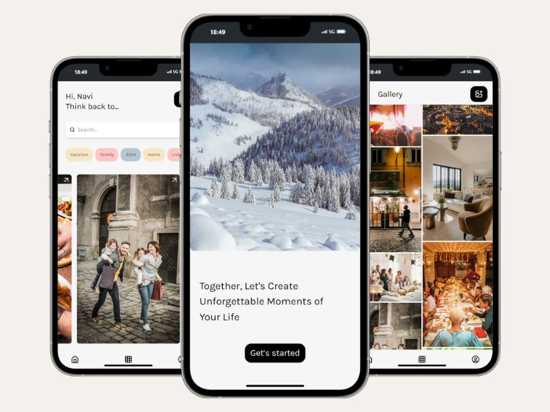

<div align="center"> 
  <h1>Memories album App with TypeScript and Firestore</h1>
</div>
<div align="center"> 
  
  
   
  
  
  
  
  
  
  
  
  
  
    
</div>

## Description

The **Memories Album App** is a project built using **React**, **TypeScript**, and **Firestore** (Firebase). It allows users to organize and display their favorite photo albums. The app was designed to be simple and intuitive, making it easy to manage albums and filter images by category.

Images displayed in the app are sourced from **Unsplash**.

## Key Features

- View and filter albums by categories
- Dynamic photo gallery with smooth transitions
- Responsive design for different screen sizes
- Integrated with Firestore for managing data
- Support for two different data handling strategies:
  - **Main branch**: Firebase and Firestore
  - **Local-JSONServer branch**: Axios and JSON Server for local development

## Screenshots
<div align="center">
  
</div>

## How to Use

The project can be used in two different ways depending on the branch you are on:

1. **Main branch**: Uses **Firebase** and **Firestore** to handle data and is the version deployed on Vercel.
2. **Local-JSONServer branch**: This branch is for local development and uses **JSON Server** and **Axios** to simulate an API.

### Clone the project

First, clone the repository to work with the code locally.

```bash
# Clone the repository
git clone https://github.com/EvelinAlvarado/memories-album-app.git

# Navigate to the project folder
cd memories-album-app
```


## Additional Information

- **Developed by**: Evelin Alvarado
- **GitHub**: [EvelinAlvarado](https://github.com/EvelinAlvarado)
- **LinkedIn**: [Evelin Alvarado](https://www.linkedin.com/in/evelinalvarado/)
- **Live Project**: [MemoryLane Application](https://memorylane-album-app.vercel.app/)
- The images used in the app are sourced from **[Unsplash](https://unsplash.com/)**.
- The design was inspired by a project on Figma: **[Figma](https://www.figma.com/design/GVFXf0xcAEj8lJCNEgCeii/Memories-Albums-App-(Community)?node-id=0-1&node-type=canvas&t=mNzNy0vum0PBqKJw-0)**.

Feel free to explore the code and contribute to the project!
